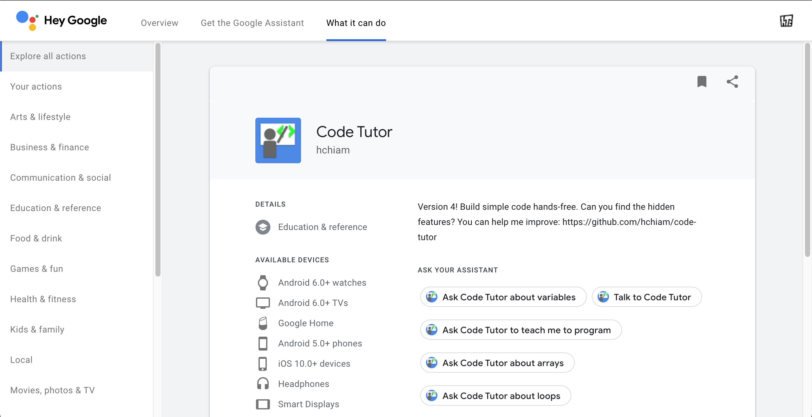
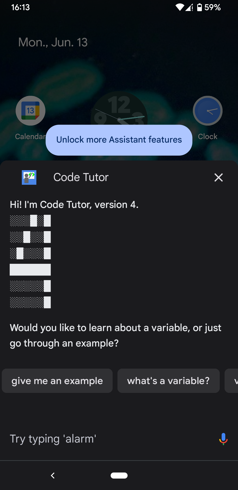

# Ok Google, Talk to Code Tutor 

**Try it now:** <a href="https://assistant.google.com/services/invoke/uid/000000668d1fb538">🅖 Ask Code Tutor to teach me</a>

**Code Tutor** is listed in the [Google Assistant web directory](https://assistant.google.com/services/a/uid/000000668d1fb538).

**Long-term goal**: Let's help people who can't use their hands to learn to code by talking to the Google Assistant.

**For now**: Conversationally teach simple coding concepts. Code hands-free.

Made possible thanks to support from family and friends.

Built using lessons learned from my [mental-temp-converter backend](https://glitch.com/edit/#!/mental-temp-converter) and a [Zeitspace workshop](https://github.com/zeitspace/AssistantAppWorkshop) I attended. (EDIT: Now updated to use API V2.)

Privacy policy: https://goo.gl/PMwsDW

**2023 news:** [Conversational Actions are scheduled to sunset in 2023](https://developers.google.com/assistant/ca-sunset).

## Use the Google Assistant on Your Phone:

This app works great on a device with a screen. You can get the Google Assistant on your device:

- Android: https://assistant.google.com/intl/en_ca/platforms/phones/
- iPhone/iPad (I haven't tried it): https://itunes.apple.com/ca/app/google-assistant/id1220976145

## Files:

I'm open-sourcing my code to help others learn faster (just please change the author in [package.json](https://github.com/hchiam/code-tutor/blob/master/package.json) before you publish). It also enables you to help me improve the app faster by contributing on GitHub.

- **START HERE**: [Screenshots for reference](https://github.com/hchiam/code-tutor/blob/master/screenshots_for_reference). Use them to get a quick overview of the app's conversation flow. Start at _"1.0 Default Welcome intent"_. I think I followed best practice by treating each [intent](https://dialogflow.com/docs/intents) name as a numbered bullet point (or sub-point). This makes it easier to navigate them all when Dialogflow alphabetically sorts them.
- [index.js](https://github.com/hchiam/code-tutor/blob/master/index.js) is my inline editor code in Dialogflow. Use it to figure out how to use the inline editor to add extra functionality to the intents. For it to work, my code requires the imports listed in [package.json](https://github.com/hchiam/code-tutor/blob/master/package.json)
- [package.json](https://github.com/hchiam/code-tutor/blob/master/package.json) (you’ll see a tab for this in the inline editor in Dialogflow).
- The [CodeTutor](https://github.com/hchiam/code-tutor/tree/master/Code-Tutor) folder is an un-zipped export of my agent from Dialogflow, which may contain the app’s [intents](https://dialogflow.com/docs/intents), [entities](https://dialogflow.com/docs/entities), and other info besides the other 2 files. **_NOTE:_** If you're **_importing_** the zip file into your own Dialogflow project, make sure to set the "-1.0 No/Bye" intent's response as end of conversation in the Dialogflow interface. This option does not appear to be stored in the intents .json files, so you'll have to set this option manually.

## Hidden Features:

Hint: try a number over 9000 :)

## Want to Create Your Own Google Assistant App?

Check out these AoG codelabs: https://developers.google.com/actions/codelabs/

## Related:

https://github.com/hchiam/code-tutor-sandbox-test and https://code-tutor-sandbox-test.glitch.me/

## Previous Work:

- https://glitch.com/edit/#!/code-tutor (I started coding directly in Dialogflow's inline editor instead)
- [Mental Temperature Converter app](https://github.com/hchiam/mental-temperature-converter) for the Google Assistant
- The programming [add-on](https://github.com/hchiam/language-user-interface/blob/master/add-on.js) for [LUI](https://github.com/hchiam/language-user-interface), a voice assistant kinda like a mini JARVIS that lives in the browser
- [Please](https://github.com/hchiam/please), an experimental programming language
- My [programmingByVoice](https://github.com/hchiam/programmingByVoice) web interface
- [How](https://github.com/hchiam/how), an interactive programming test

## Newer Experiment:

https://github.com/hchiam/ccc

## You Might Also Like:

https://github.com/hchiam/sourcefetch-server
